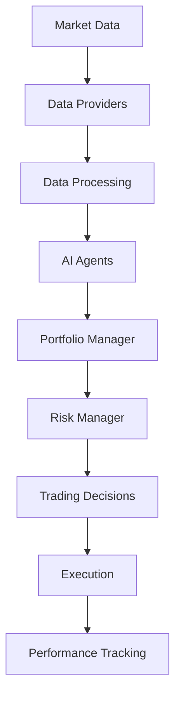

# AI Hedge Fund Documentation

Welcome to the AI Hedge Fund documentation! This project is an AI-powered hedge fund system that uses multiple specialized agents to make trading decisions based on financial data analysis.

## 🚀 Features

- **Multi-Agent Architecture**: Multiple specialized AI agents (Warren Buffett, Cathie Wood, etc.) analyze stocks
- **Data Providers**: Support for multiple data sources (Yahoo Finance, FinancialDatasets.ai)
- **Local LLM Integration**: Run completely free using local Ollama models
- **Real-time Analysis**: Process historical and real-time market data
- **Portfolio Management**: Automated portfolio optimization and risk management
- **Backtesting**: Comprehensive backtesting framework for strategy validation

## 🏗️ Architecture Overview

The AI Hedge Fund uses a sophisticated architecture:



## 📦 Quick Start

### Installation

```bash
# Clone the repository
git clone https://github.com/your-username/ai-hedge-fund.git
cd ai-hedge-fund

# Set up development environment
./scripts/dev_setup.sh

# Run the application
./scripts/run_app.sh --tickers AAPL,MSFT,GOOGL --start-date 2024-01-01 --end-date 2024-03-01
```

### Basic Usage

```python
from src.data.providers import get_data_provider
from src.agents import portfolio_management_agent

# Get data provider
data_provider = get_data_provider("yahoo")

# Fetch market data
prices = data_provider.get_prices("AAPL", "2024-01-01", "2024-03-01")

# Run portfolio analysis
portfolio = {
    "cash": 100000.0,
    "positions": {"AAPL": 100, "MSFT": 50}
}

result = portfolio_management_agent(prices, portfolio)
print(f"Recommended actions: {result}")
```

## 🎯 Key Components

### Data Providers
- **YahooProvider**: Free Yahoo Finance data integration
- **FDProvider**: FinancialDatasets.ai premium data (requires API key)

### AI Agents
- **Warren Buffett Agent**: Value investing strategies
- **Cathie Wood Agent**: Growth and innovation focus
- **Risk Management Agent**: Portfolio risk assessment
- **Technical Analysis Agent**: Chart pattern recognition

### Utilities
- **Caching System**: Redis and memory caching for performance
- **Logging**: Structured logging with error handling
- **Performance Monitoring**: Real-time performance tracking
- **Parallel Processing**: Concurrent data fetching

## 🔧 Configuration

Configure the system using environment variables or the `.env` file:

```bash
# Data source configuration
DATA_PROVIDER=yahoo  # or 'financialdatasets'
DATA_CACHE_ENABLED=true

# LLM configuration  
OLLAMA_BASE_URL=http://localhost:11434
DEFAULT_OLLAMA_MODEL=qwen3.5:latest

# Performance settings
MAX_CONCURRENT_REQUESTS=5
REQUEST_TIMEOUT=30
```

## 📊 Performance Monitoring

The system includes comprehensive performance monitoring:

- Execution time tracking
- Success rate analytics
- Error rate monitoring
- Resource usage tracking
- Real-time performance dashboards

## 🤝 Contributing

We welcome contributions! Please see our [Development Guide](development/guide.md) for details on how to contribute to this project.

## 📄 License

This project is licensed under the MIT License - see the [LICENSE](https://github.com/your-username/ai-hedge-fund/blob/main/LICENSE) file for details.

## 🆘 Support

If you need help or have questions:

1. Check the [FAQ](getting-started/faq.md)
2. Open an [issue](https://github.com/your-username/ai-hedge-fund/issues)
3. Join our [Discord community](https://discord.gg/ai-hedge-fund)

## 🔗 Useful Links

- [GitHub Repository](https://github.com/your-username/ai-hedge-fund)
- [Issue Tracker](https://github.com/your-username/ai-hedge-fund/issues)
- [Releases](https://github.com/your-username/ai-hedge-fund/releases)
- [Changelog](https://github.com/your-username/ai-hedge-fund/blob/main/CHANGELOG.md)